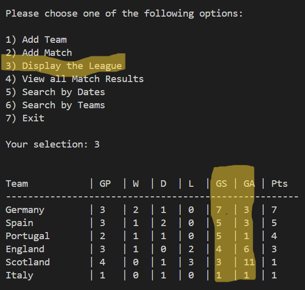
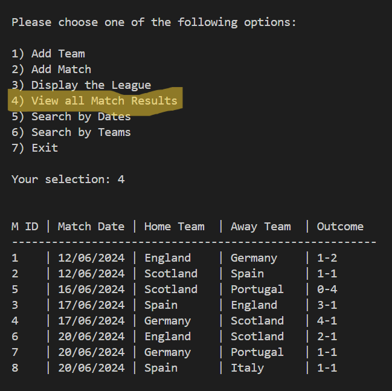
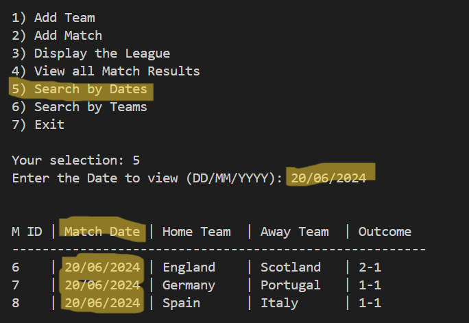

# Football Project - Part 2
Created a part 2 of the football project, which is the continuous project from part 1 of the simple football project and using the same SQL and Python tools

Please click [Simple Football project](https://github.com/n1k35h/simple_football_project) to view the part 1 of the football project.

To carry on from part 1, in part 2 of this football project I have added the following attributes to the project:

- Added Total goals scored and total goals conceded to the league table.

- View all matches with date, team and result of the matches

- View matches by Dates - e.g: Displays the matches that played on date 20/06/2024 

- View matches by Teams

To view the complete code, kindly refer to [fs_p2.py](fs_p2.py) and [fa_p2.py](fa_p2.py)

### Next Stage - [Football Project - Part 3](https://github.com/n1k35h/football_project_part3_using-python_-_sql) 

- Add Country
- Add extra Leagues (e.g English Premier League, Serie A, Ligue 1, La Liga, etc)
- Add extra Teams from English Premier League, Series A, Ligue 1, La Liga, etc
- Add Player Statistics
- Add Team Statistics
- Add last 5 result to each team in the league
