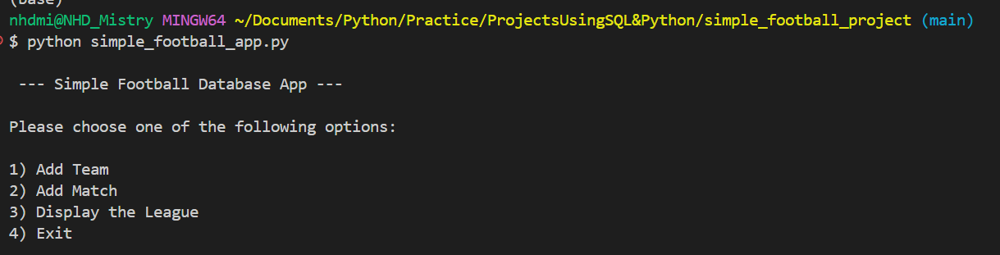
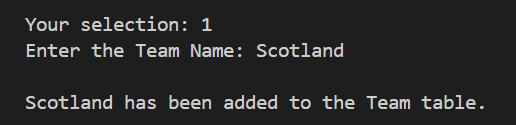
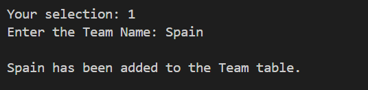
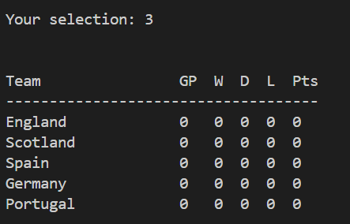
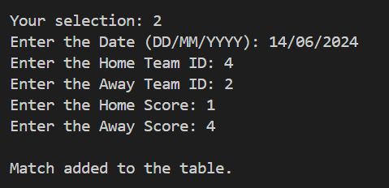
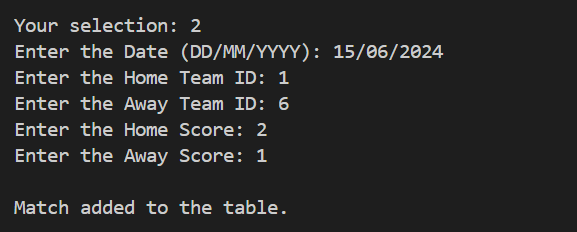
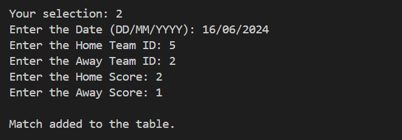
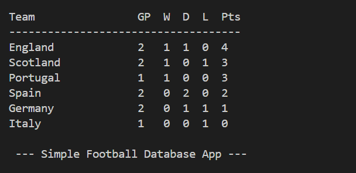

# Simple Football project - Part 1
I have developed a basic football application utilizing SQL and Python technologies. This project highlights my proficiency in Python and SQL database management.

The application enables users to enter a football team, which then becomes part of the league table. Users can record match results to assess the teams' standings within the league.

For instance, when both Team A and Team B are entered, they are immediately added to the league table for future match utilisation.

As an example, if Team B competes against Team A and wins, Team B will receive 3 points and move ahead of Team A, which will remain with zero points in the league standings.

### Preview

1. simple_football_app.py is executed

2. To add football teams into the application, select option 1

  

3. After the teams have been entered, they will be automatically added to the league. To check the current league standings, select option 3 to display all the teams.

4. Input match results for the teams that have been added to the league. Following the entry of the match results, the teams will be ranked according to the outcomes.

Example of recorded matches after option 2 is entered

   

Once the matches have been logged, select option 3 to view the standings and see the positions of each team.

To view the complete code, kindly refer to [simple_football_system.py](simple_football_system.py) and [simple_football_app.py](simple_football_app.py)

### Next stage - [Football Project - Part 2](https://github.com/n1k35h/football_project_part2_using-python_-_sql)
- Adding more SQL queries
- To add Goals Scored and Goals Conceded to the League table.
- View all matches
- Search by Teams to see their records against other teams 
- Search by Dates 

